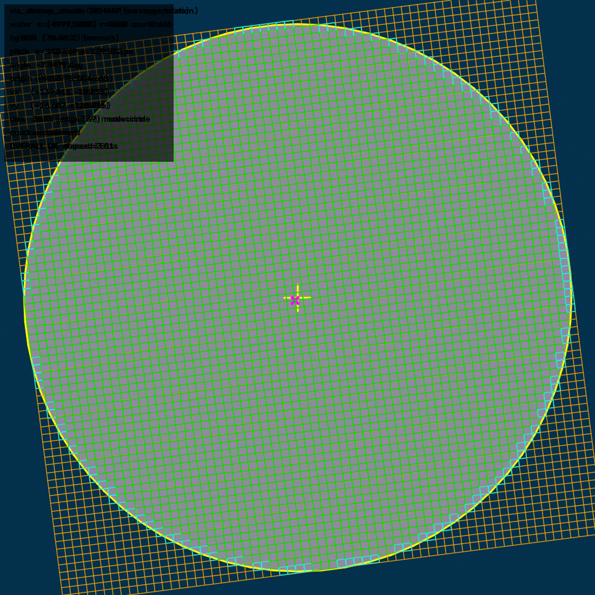

# Wafer_Via

## codex — 현재 권장 wafer die-map

YOLO centre-clip cross-points로 중심 corner와 `pitch_x`, `pitch_y`를 구하고,
full wafer의 **아래쪽 외곽 원에 파인 notch**로만 회전각을 계산하는 모듈입니다.

고정 ROI를 지정한 현재 권장 방식은 ROI에서 외부 배경색을 학습하고, 영상 테두리와
연결된 배경으로 wafer 외곽원을 fitting합니다. ROI 안의 반원/반타원 notch 검출이
실패할 때만 같은 외곽원·배경을 사용하는 **형상 비제한 함몰 검출**로 보완합니다.
기존 검출이 성공하면 보완 로직은 실행하지 않습니다. ROI를 생략한 기존 아래쪽
colour-edge 방식과 `notch_use_roi_background=False` 경로에는 이 보완을 적용하지 않습니다.

- notch 사용법과 실제 데이터 진단 순서: [`codex/README_NOTCH.md`](codex/README_NOTCH.md)
- 고정 좌표 ROI 반원 notch angle 보정: [`codex/README_NOTCH_ROI_SEMICIRCLE_KO.md`](codex/README_NOTCH_ROI_SEMICIRCLE_KO.md)
- 미검출 때만 실행하는 보완 검출·진단: [`codex/README_NOTCH_FALLBACK_KO.md`](codex/README_NOTCH_FALLBACK_KO.md)
- 단일 한국어 통합 설명서: [`codex/NOTCH_ALIGNED_DM_GUIDE_KO.md`](codex/NOTCH_ALIGNED_DM_GUIDE_KO.md)
- 복붙용 단일 파일: [`codex/wafer_via_notch_standalone.py`](codex/wafer_via_notch_standalone.py)
- 유지보수용 조립 파일: [`codex/wafer_via_notch.py`](codex/wafer_via_notch.py)
- notch 검출/오버레이: [`codex/wafer_notch_angle.py`](codex/wafer_notch_angle.py)
- notch-only 리팩터링·출력 성능 측정: [`codex/NOTCH_ONLY_REFACTOR_BENCHMARK_KO.md`](codex/NOTCH_ONLY_REFACTOR_BENCHMARK_KO.md)
- 기본 YOLO/DM 상세 설명: [`codex/README.md`](codex/README.md)
- 샘플: [`codex/sample_img/Clip_sample.png`](codex/sample_img/Clip_sample.png)
- 테스트: [`tests/test_wafer_notch_angle.py`](tests/test_wafer_notch_angle.py) · [`tests/test_wafer_via.py`](tests/test_wafer_via.py)

권장 호출의 핵심 옵션은 아래와 같습니다.

```python
from codex.wafer_via_notch import build_die_map_from_yolo

dm = build_die_map_from_yolo(
    wafer_image=wafer_bgr,
    clip_image=center_clip_bgr,
    detections=results[0].boxes.xywh.cpu().numpy(),
    detection_format="xywh",
    # 예시 좌표: 실제 notch 전체와 양쪽 정상 외곽이 들어오도록 조정합니다.
    notch_roi_center_px=(5000, 9650),
    notch_roi_half_size_px=(600, 600),
    notch_use_roi_background=True,
    notch_fallback_mode="rim_intrusion",  # 기본값: 미검출 때만 보완. "none"이면 끔
    notch_search_center_angle_deg=90.0,
    notch_search_half_width_deg=45.0,
    notch_max_dimension=4096,  # 10000x10000에서 매우 얕은 notch
    notch_failure_mode="error",  # 기존·보완 모두 미검출: 예외. "zero"는 보정각 0°
    # 기본값 False: overlay/zoom 없이 aligned_image만 생성
    return_notch_visuals=False,
)
```

복붙용 파일 전체를 실행할 코드 위에 붙였다면 위 `from ... import ...` 줄은 필요
없습니다. 보완 여부와 이유는 `dm.notch_fallback_used`, `dm.notch_fallback_reason`으로,
검출 근거는 `return_notch_visuals=True`의 오버레이로 확인합니다. 보완 검출도 잘린
입구나 모호한 복수 후보는 거절합니다. **기존 검출이 성공으로 판정한 오검출을
재검사하는 기능은 아닙니다.**

`wafer_via_die_render.py`와 YOLO angle 방식은 비교·보관용 legacy입니다. 현재 권장
notch pipeline의 angle fallback으로 호출되지 않습니다.

notch 보정각은 이미지에 적용됩니다. 반환되는 `dm.dies`와 `locate_die()`는 회전된
`dm.aligned_image` 좌표계에서 수평·수직이며 `dm.grid_angle_deg == 0.0`입니다.
기본 결과 이미지는 `dm.aligned_image` 하나입니다. 진단할 때만
`return_notch_visuals=True`로 설정하여 `dm.notch_overlay_image`와
`dm.notch_zoom_image`를 만듭니다.
정렬된 이미지 위에서 V5 방식 외곽 원·notch·잔여각 선을 확인하고 직접 정답을
덧그리려면 `draw_aligned_wafer_notch_guide(dm.aligned_image)`를 사용하십시오.

## via_claude — PAD 안의 VIA 검출·판정

순수 OpenCV 만으로 PAD 안의 VIA 를 찾아 양·불량 코드(`1` / `42` / `-1`)를 돌려줍니다.
파일 하나만 복사해 가면 바로 쓸 수 있습니다.

- 사용법: [`via_claude/README.md`](via_claude/README.md)
- 검출 원리: [`via_claude/DETECTION.md`](via_claude/DETECTION.md)
- 코드: [`via_claude/via_checker.py`](via_claude/via_checker.py) (검출+판정) · [`via_claude/via_code.py`](via_claude/via_code.py) (판정만)

## claude — YOLO 십자점 -> 10000x10000 wafer die map

512x512 센터 클립의 YOLO 십자 좌표를 서브픽셀 보정해 pitch_x/pitch_y/회전각을
구하고, 웨이퍼 외곽선을 검출해 die map 을 만듭니다. 좌표를 넣으면 die index 가
나옵니다. 색 조합이 바뀌어도 같은 코드가 돕니다.

- 사용법/실측 성능: [`claude/README.md`](claude/README.md)
- 보정: [`claude/via_refine_claude.py`](claude/via_refine_claude.py)
- 격자/회전각: [`claude/via_grid_claude.py`](claude/via_grid_claude.py)
- 외곽선/die map/locate/오버레이: [`claude/via_diemap_claude.py`](claude/via_diemap_claude.py)
- 합성 테스트 데이터: `claude/synth_clip_claude.py` · `claude/synth_wafer_claude.py`
- 테스트: `claude/test_refine_claude.py` · `claude/test_grid_claude.py` · `claude/test_diemap_claude.py`


