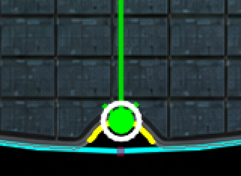
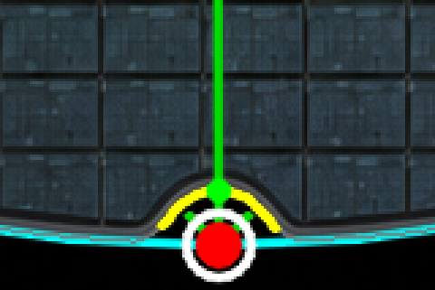
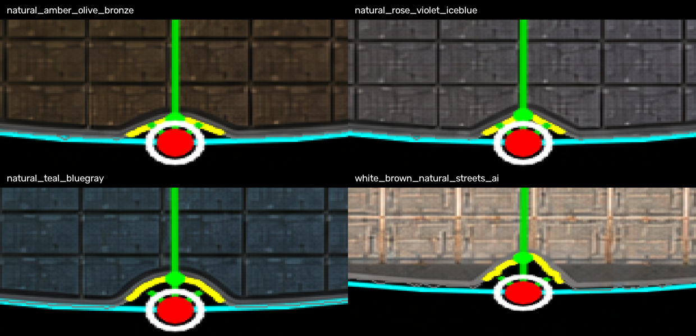
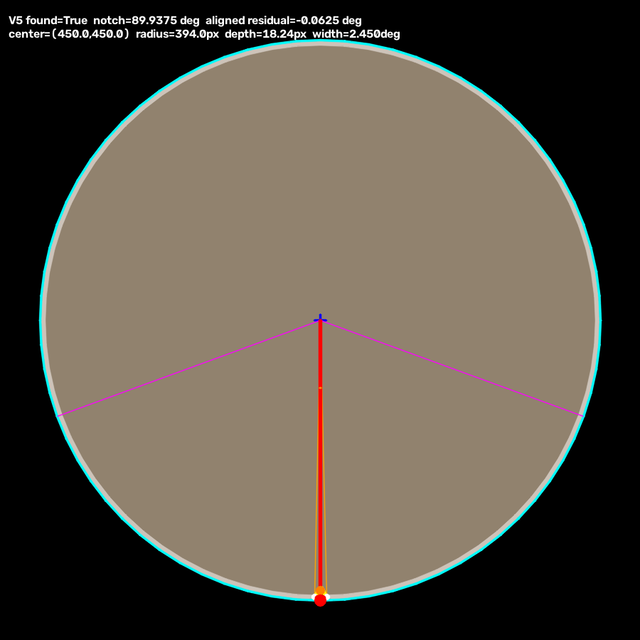

# Wafer notch angle pipeline

입력부터 좌표 변환, `locate_die()`, 반환 이미지 저장까지 한 문서로 보려면 [NOTCH_ALIGNED_DM_GUIDE_KO.md](./NOTCH_ALIGNED_DM_GUIDE_KO.md)를 사용하십시오.

notch 예상 좌표를 직접 지정하고 ROI 안의 반원만으로 angle을 보정하려면
[README_NOTCH_ROI_SEMICIRCLE_KO.md](./README_NOTCH_ROI_SEMICIRCLE_KO.md)를 사용하십시오.

새 방향의 angle 기준은 YOLO 점, die line, projection 또는 FFT가 아니라 wafer notch 하나입니다.

## 복붙용 파일

아래 파일 하나만 복사하면 됩니다.

```text
wafer_via_notch_standalone.py
```

필요한 외부 패키지는 `numpy`, `opencv-python`입니다.

```python
from wafer_via_notch_standalone import build_die_map_from_yolo

dm = build_die_map_from_yolo(
    wafer_image=wafer_bgr,
    clip_image=center_clip_bgr,
    detections=results[0].boxes.xywh.cpu().numpy(),
    detection_format="xywh",
    clip_origin=(clip_x, clip_y),

    # notch가 정렬된 뒤 위치할 기준 방향: 아래쪽 6시
    notch_reference_angle_deg=90.0,

    # 현재 영상에서 notch가 있을 것으로 예상하는 구간: 아래쪽 +/-45도
    notch_search_center_angle_deg=90.0,
    notch_search_half_width_deg=45.0,

    # 권장: notch 미검출 시 즉시 RuntimeError
    notch_failure_mode="error",
)
```

YOLO 좌표는 center corner와 `pitch_x`, `pitch_y`를 찾는 데만 사용합니다. notch에서 구한 보정각은 **full wafer 이미지를 회전하는 데만 적용**합니다. 반환되는 DM은 회전된 `aligned_image` 좌표계에서 다시 생성되므로 `grid_angle_deg=0.0`이고 수평·수직입니다.

```text
원본 wafer_image -- notch 보정각으로 회전 --> dm.aligned_image
원본 origin/points -- 같은 affine 변환 --> dm.x0/y0, dm.dies
                                           dm.grid_angle_deg = 0
```

## 빨간 기준점 정의

1. BGR/LAB 값으로 wafer와 배경을 분류하지 않습니다. LAB 각 채널의 **색 변화량(edge strength)**만 계산합니다.
2. 영상 중심 부근에서 여러 각도에 공통으로 나타나는 가장 바깥쪽 원형 edge를 초기 wafer 반지름으로 선택합니다.
3. notch 예상 구간(기본 아래쪽 ±45°)을 제외한 원주 edge로 중심과 반지름을 반복 보정합니다. 따라서 wafer 중심과 image 중심이 조금 달라도 보정됩니다.
4. 예상 원주 근처의 edge를 각도별로 추적하여 실제 외곽 radius profile을 만듭니다.
5. 아래쪽 검색 구간에서 profile이 기준 원보다 안쪽으로 연속해서 들어온 구간을 찾습니다. 깊이, 각도 폭, 면적, edge support를 함께 진단합니다.
6. 선택된 함몰 구간 좌우 끝의 각도상 가운데를 구하고, 그 방향을 원래 wafer 외곽 원까지 연장한 점을 `notch_point_px`로 반환합니다.

배경이 검정인지, 흰색인지, 특정 RGB/HSV 범위인지 전혀 가정하지 않습니다. notch 모양도 V, U 또는 반원 template로 고정하지 않습니다. 기본값은 notch가 항상 영상 아래쪽 부근이라는 장비 조건만 사용합니다.

이 점이 `natural_teal_bluegray_notch_zoom_red.png`에 사용자가 표시한 빨간점입니다. 홈의 가장 안쪽 점은 angle 기준으로 사용하지 않고 `notch_deepest_point_px`에 진단용으로만 보존합니다.

### 사용자 정답과 개선 결과

사용자가 표시한 기준점:



개선된 검출 결과:



사용자 표시를 원본 좌표로 역산한 값은 약 `(627.86, 1237.76)`, 개선된 검출값은 `(627.95, 1237.24)`이며 차이는 약 `0.53px`입니다.

네 가지 색상 조건의 확대 검출 결과:



이미지 좌표 angle은 다음과 같습니다.

```text
오른쪽 =   0°
아래쪽 =  90°
왼쪽   = 180°
위쪽   = 270°
```

`correction_angle_deg`는 notch를 `notch_reference_angle_deg` 방향으로 옮기는 OpenCV 회전값입니다.

## 주요 반환값

```python
print(dm.angle_align_method)             # "notch"
print(dm.coordinate_space)               # "aligned_image"
print(dm.grid_angle_deg)                 # 0.0: DM 자체는 회전하지 않음
print(dm.image_rotation_deg)             # 원본 이미지에 적용한 notch 보정각
print(dm.source_grid_angle_deg)           # 원본 영상에서 측정한 격자 방향
print(dm.angle_confidence)

print(dm.notch_point_px)                 # 사용자 확인 빨간점: 외곽 원 위 기준 좌표
print(dm.notch_deepest_point_px)         # 홈의 최심점: 진단 전용
print(dm.notch_angle_deg)                # 중심→빨간점의 image-space angle
print(dm.notch_reference_angle_deg)      # 기본 90°
print(dm.notch_depth_px)
print(dm.notch_width_px)
print(dm.notch_result)
print(dm.notch_result.found)             # notch 검출 성공 여부
print(dm.notch_result.failure_mode)      # "error" 또는 "zero"
print(dm.notch_result.detection_method)  # "geometry_edge_bottom_sector"
print(dm.notch_result.edge_support)      # 선택된 edge의 상대 강도, 0~1
print(dm.notch_result.circle_fit_residual_px)  # 기준 원 fitting 잔차
print(dm.notch_result.search_center_angle_deg)
print(dm.notch_result.search_half_width_deg)

print(dm.notch_overlay_image)            # 원본 영상 위 notch 전체 진단 overlay
print(dm.notch_zoom_image)               # notch 주변 확대 진단 이미지
print(dm.notch_point_aligned_px)         # aligned_image 좌표의 notch 기준점

print(dm.pitch_x, dm.pitch_y)
print(dm.x0, dm.y0)                      # aligned_image 좌표
print(dm.dies)                           # aligned_image 좌표, angle=0
print(dm.aligned_image)                  # 기본적으로 보정된 full wafer 반환
```

`dm.notch_result.notch_point_px`, `notch_deepest_point_px`와 `notch_overlay_image`는 검출 당시의 **원본 이미지 좌표계**입니다. `dm.notch_point_aligned_px`, `dm.x0/y0`, `dm.dies`, `locate_die(dm, ...)`는 **보정된 `aligned_image` 좌표계**입니다.

원본 영상 좌표를 보정 좌표로 옮길 때는 다음 matrix를 사용합니다.

```python
point_original = np.asarray([x, y, 1.0])
point_aligned = dm.original_to_aligned_matrix @ point_original

# 반대 방향
point_original_again = (
    dm.aligned_to_original_matrix
    @ np.asarray([point_aligned[0], point_aligned[1], 1.0])
)
```

기존 angle 좌표쌍은 생성하지 않습니다.

```python
assert dm.angle_pairs_full == ()
assert dm.grid_estimate.angle_pairs_clip == ()
assert dm.grid_estimate.angle_candidate_count == 0
```

## notch만 먼저 확인

```python
from wafer_via_notch_standalone import (
    detect_wafer_notch,
    make_notch_overlay,
    make_notch_zoom,
)

notch = detect_wafer_notch(
    wafer_bgr,
    failure_mode="error",               # 미검출 시 RuntimeError
)

print(notch.notch_point_px)
print(notch.notch_deepest_point_px)
print(notch.notch_angle_deg)
print(notch.correction_angle_deg)
print(notch.confidence)

overlay = make_notch_overlay(wafer_bgr, notch)
zoom = make_notch_zoom(wafer_bgr, notch)

cv2.imwrite("notch_overlay.png", overlay)
cv2.imwrite("notch_zoom.png", zoom)
```

## aligned image에 V5 외곽 원·notch·각도선 그리기

`dm.aligned_image`를 사람이 직접 확인하고 정답점을 추가할 때는
`draw_aligned_wafer_notch_guide()`를 사용합니다. 이 함수는 입력 영상을
다시 회전하거나 DM을 만들지 않습니다. V5에서 사용하던 검정 배경 임계값,
최대 contour, `minEnclosingCircle`, 아래쪽 방사형 notch 탐색을 그대로 사용해
진단선이 들어간 **동일 크기 BGR 복사본**을 반환합니다.

```python
import cv2
from wafer_via_notch_standalone import draw_aligned_wafer_notch_guide

guide = draw_aligned_wafer_notch_guide(
    dm.aligned_image,             # np.ndarray 또는 이미지 경로
    reference_angle_deg=90.0,     # 정렬 후 정상 notch 방향: 아래쪽/6시
    failure_mode="zero",          # 못 찾아도 외곽 원과 탐색선은 반환
)

print(guide.found)
print(guide.wafer_center_px)
print(guide.wafer_radius_px)
print(guide.notch_center_px)       # V5 파임 내부 중심, 미검출이면 None
print(guide.notch_point_px)        # 외곽 원 위 notch 방향점, 미검출이면 None
print(guide.notch_left_px)
print(guide.notch_right_px)
print(guide.notch_angle_deg)
print(guide.residual_angle_deg)    # aligned image에 남은 각도 오차
print(guide.notch_depth_px)
print(guide.notch_width_deg)

# 반환 배열은 writable입니다. 사용자가 판단한 정답을 바로 추가할 수 있습니다.
manual = guide.overlay_image
my_answer_xy = (5123, 9876)
cv2.circle(manual, my_answer_xy, 18, (255, 0, 0), -1, cv2.LINE_AA)
cv2.putText(
    manual, "MY ANSWER", (my_answer_xy[0] + 24, my_answer_xy[1]),
    cv2.FONT_HERSHEY_SIMPLEX, 0.8, (255, 0, 0), 2, cv2.LINE_AA,
)
cv2.imwrite("aligned_notch_manual_check.png", manual)
```

표시 색상은 OpenCV BGR 기준입니다.

- 하늘색 원: V5 `minEnclosingCircle` Wafer 외곽 링
- 회색선: V5 임계 마스크에서 얻은 실제 최대 contour
- 초록선: 정렬 기준각, 기본 90° 아래쪽
- 빨간선·빨간점: 검출된 notch 방향과 외곽 원 위 기준점
- 주황색 짧은 arc: 초록 기준선부터 빨간 검출선까지의 잔여각
- 노란선: 방사형 스캔에서 분리된 notch 후보 구간
- 주황색 점: notch 파임 내부의 깊이 가중 중심
- 흰점·주황선: notch 후보의 좌우 경계와 각도선
- 자홍색선: notch 탐색 sector 양 끝
- 파란 십자: V5 Wafer 중심

aligned 결과가 정확하면 `residual_angle_deg`가 0° 근처여야 합니다. 노치를
못 찾았을 때도 그림을 확인하려면 기본값인 `failure_mode="zero"`를 사용합니다.
미검출을 즉시 예외로 처리하려면 `"error"`로 바꿉니다.

V5 방식은 기본적으로 배경을 `gray <= 20`으로 간주합니다. 기존 장비 영상의
배경 밝기가 다르면 `bg_threshold`만 조절하십시오. 외곽 검출 기본값은 V5와
같은 `wafer_morph_kernel=25`, notch 실루엣은
`silhouette_open_kernel=3`입니다.

아래 그림은 표시 색과 선 구성을 확인하기 위한 합성 이미지 예시입니다. 실제
장비 성능을 주장하는 결과가 아니라, 사용자가 어느 선 위에 정답을 그려야 하는지
보여주는 용도입니다.



오버레이 색상:

- 빨간점: 최종 angle 기준인 외곽 원 위 좌표
- 작은 초록점: notch 최심점 진단 좌표
- 초록선: wafer 중심에서 빨간점으로 향하는 angle 벡터
- 노란선: 분리된 notch contour 구간
- 하늘색 원: 추정한 원래 wafer 외곽 원
- 회색 contour: 각도별로 실제 추적한 외곽 edge
- 자홍색 두 직선: notch를 탐색한 각도 구간의 양 끝

## 주요 옵션

| 옵션 | 기본값 | 의미 |
|---|---:|---|
| `notch_reference_angle_deg` | `90.0` | 보정 후 notch가 위치할 방향 |
| `notch_max_dimension` | `3072` | 큰 이미지의 notch 검출용 축소 크기. 아주 얕은 notch는 4096 이상 권장 |
| `notch_angle_samples` | `3600` | 원주 반지름 sampling 수, 기본 0.1° 간격 |
| `notch_baseline_window_deg` | `10.0` | 이전 호출과의 호환용 인자. 현재 기하 원 fitting을 사용하므로 값은 사용하지 않음 |
| `notch_min_depth_px` | `None` | 수동 최소 notch 깊이, 원본 이미지 px |
| `notch_min_depth_ratio` | `0.001` | 자동 최소 깊이, wafer 반지름 비율. 10000px 이미지의 얕은 notch 대응 기본값 |
| `notch_min_wide_deg` | `2.0` | 얕은 notch로 인정할 최소 각도 폭 |
| `notch_search_center_angle_deg` | `90.0` | 현재 영상에서 notch를 찾을 예상 방향. 아래쪽=90° |
| `notch_search_half_width_deg` | `45.0` | 예상 방향 좌우 검색 폭. 기본 검색 범위 45~135° |
| `notch_wafer_center_hint_px` | `None` | 자동 원 검출이 틀릴 때 넣는 full wafer 이미지 중심 `(x, y)` |
| `notch_wafer_radius_hint_px` | `None` | 자동 원 검출이 틀릴 때 넣는 full wafer 이미지 반지름 px |
| `notch_failure_mode` | `"error"` | 미검출 시 `"error"`는 예외, `"zero"`는 보정각 0 반환 |
| `return_aligned_image` | `True` | notch 보정된 full wafer 이미지를 `dm.aligned_image`로 반환 |
| `return_notch_visuals` | `True` | notch 전체 overlay와 확대 이미지를 반환 |
| `notch_visual_max_dimension` | `2048` | 전체 overlay의 최대 변 길이. 10000px 원본 메모리 절감용 |
| `notch_zoom_size_px` | `256` | 원본 좌표에서 notch 확대 crop의 반쪽 크기 |
| `notch_zoom_scale` | `2.0` | notch 확대 이미지 배율 |

두 모드 모두 YOLO, FFT, projection 또는 die-render angle로 fallback하지 않습니다.

### notch 미검출 처리 선택

운영 중 잘못된 각도로 DM을 만드는 것을 막으려면 기본값인 `"error"`를 권장합니다.

```python
dm = build_die_map_from_yolo(
    ...,
    notch_failure_mode="error",
)
# 미검출: RuntimeError
```

notch가 없는 이미지도 그대로 처리해야 하면 `"zero"`를 사용합니다.

```python
dm = build_die_map_from_yolo(
    ...,
    notch_failure_mode="zero",
)

if not dm.notch_result.found:
    assert dm.grid_angle_deg == 0.0
    assert dm.image_rotation_deg == 0.0
    assert dm.angle_align_method == "notch_zero_fallback"
```

notch 검출 함수만 직접 호출할 때는 `failure_mode="zero"`로 같은 정책을 지정합니다. 이 경우 `correction_angle_deg=0.0`, `found=False`이고, `notch_point_px`는 진단과 오버레이 형식 유지를 위해 설정한 기준 방향의 외곽 원 좌표로 채워집니다.

### 실제 데이터에서 확인할 순서

실제 데이터는 색상과 edge 조건이 다양하므로 아래 순서로 오버레이를 확인하는 것이 중요합니다.

1. 하늘색 기준 원이 실제 wafer 외곽과 맞는지 확인합니다.
2. 회색 추적 contour가 전체 외곽을 따라가는지 확인합니다.
3. 노란 candidate arc가 아래쪽의 실제 파인 구간인지 확인합니다.
4. 기준 원부터 틀렸다면 depth threshold를 바꾸기 전에 중심/반지름 hint를 넣습니다.

```python
cv2.imwrite("notch_overview.png", dm.notch_overlay_image)
cv2.imwrite("notch_zoom.png", dm.notch_zoom_image)
cv2.imwrite("wafer_aligned.png", dm.aligned_image)
```

```python
dm = build_die_map_from_yolo(
    ...,
    notch_wafer_center_hint_px=(wafer_cx, wafer_cy),  # full image 좌표
    notch_wafer_radius_hint_px=wafer_radius,
    notch_search_center_angle_deg=90.0,
    notch_search_half_width_deg=55.0,
)
```

원은 맞지만 notch가 너무 얕아 미검출되는 경우에만 `notch_min_depth_px`를 실제 full image px 단위로 낮춥니다. `edge_support`가 낮다는 이유만으로 미검출시키지는 않으며, 이 값은 실제 데이터 판단을 위한 진단값입니다.

10000×10000 원본에서 notch 깊이가 매우 작다면 `notch_max_dimension=4096` 또는 `6144`로 올려 축소 시 edge가 사라지지 않게 하십시오. 값이 클수록 메모리와 처리 시간도 증가합니다.

## 검증 결과

- 단위 테스트에는 뾰족한 notch, 길고 얕은 반원형 notch, 회전된 notch, 비검정 가변 배경, image/wafer 중심 차이, 미검출의 `error`/`zero` 정책이 포함됩니다.
- 이 테스트는 알고리즘의 기하 동작과 API 회귀만 확인합니다. 실제 장비 데이터 성능 판정은 사용자가 생성한 overlay와 진단값으로 수행해야 합니다.
- 실제 notch 샘플에 `-27°`, `13°`, `31°` 회전을 적용했을 때 angle 오차 최대 약 `0.15°`
- 정렬 후 notch 잔여 보정각 최대 약 `0.05°`
- `wafer_via_notch_standalone.py` 한 파일만 빈 폴더에 복사한 뒤 DM 생성 성공

수동 pitch는 기존과 동일합니다.

```python
dm = build_die_map_from_yolo(
    ...,
    pitch_size=(pitch_x, pitch_y),
)
```

## 파일 구분

- `wafer_via_notch_standalone.py`: 배포·복붙용 단일 파일
- `wafer_via_notch.py`: 유지보수용 조립형 pipeline
- `wafer_notch_angle.py`: notch 검출과 시각화만 분리한 모듈
- `tools/build_wafer_via_notch_standalone.py`: 단일 파일 재생성 도구
