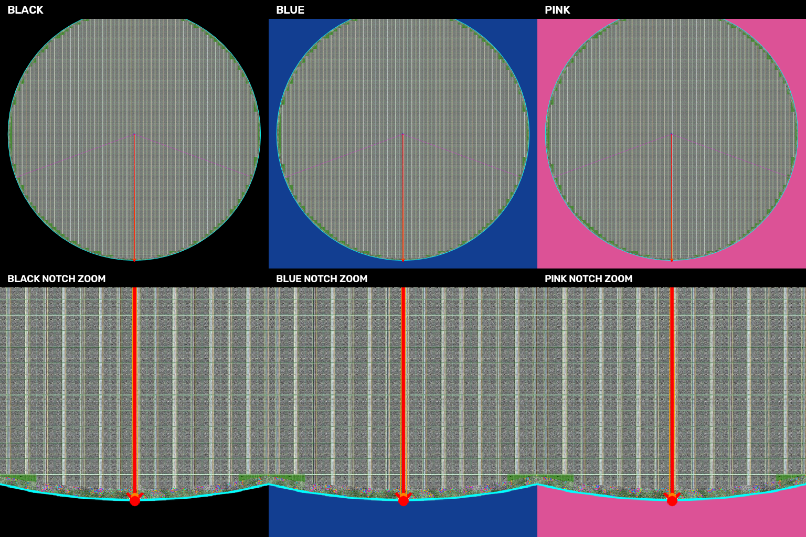

# 가변 배경 Angle 통합 복붙 버전

## 사용할 파일

```text
wafer_via_notch_adaptive_standalone.py
```

이 파일 하나에 다음 기능이 모두 들어 있습니다.

- YOLO `xywh` 좌표 입력
- center corner 계산과 좌표 refinement
- `pitch_x`, `pitch_y` 자동 또는 수동 입력
- Wafer 외곽 기준 Die Map 생성
- 이미지 밖 index 유지와 Wafer 원에 걸친 die 제거
- `locate_die`
- 원본/aligned 좌표 변환
- angle 보정된 `aligned_image`
- notch overview/zoom 반환
- 가변 배경 V5 notch angle 검출

다른 로컬 Python 파일을 import하지 않으므로 파일 하나만 복사해서 사용할 수
있습니다.

## 기존 통합 파일과 차이

기준 파일은 `wafer_via_notch_standalone.py`입니다. 새 파일에서는
`detect_wafer_notch()`만 아래 방식으로 교체했습니다.

```text
이미지 테두리에서 배경색 학습
  -> 배경과 다른 영역 중 가장 큰 contour
  -> V5 minEnclosingCircle 외곽 원
  -> 아래쪽 sector 방사형 스캔
  -> notch 방향과 보정각
```

YOLO, pitch, center corner, DM, `locate_die`, affine 좌표 변환 및 기존 반환
구조는 기준 파일의 구현을 그대로 사용합니다. 기존 파일들은 수정하지 않았습니다.

새 angle 검출 결과는 다음 값으로 구분할 수 있습니다.

```python
assert dm.notch_detection_method == "v5_border_adaptive_angle_only"
```

## 기존 호출에서 바꿀 부분

import 파일명만 바꿉니다.

```python
import cv2
import numpy as np

from wafer_via_notch_adaptive_standalone import (
    build_die_map_from_yolo,
    locate_die,
    make_wafer_overlay,
)

dm = build_die_map_from_yolo(
    wafer_image=wafer_bgr,
    clip_image=center_clip_bgr,
    detections=results[0].boxes.xywh.cpu().numpy(),
    detection_format="xywh",

    refine=True,
    refine_mode="auto",
    refine_radius=24,
    refine_noise_kernel=5,
    refine_min_confidence=0.15,

    # None이면 YOLO 점에서 자동 계산합니다.
    # 직접 알고 있으면 (pitch_x, pitch_y)를 넣을 수 있습니다.
    pitch_size=None,

    notch_reference_angle_deg=90.0,
    notch_search_center_angle_deg=90.0,
    notch_search_half_width_deg=45.0,
    notch_failure_mode="error",
    return_aligned_image=True,
    return_notch_visuals=True,
)
```

기존에 사용하던 출력은 그대로 유지됩니다.

```python
grid = dm.grid_estimate

print(grid.raw_points_clip)
print(grid.points_clip)
print(grid.refinement_confidences)
print(grid.center_corner_clip)

print(dm.pitch_x, dm.pitch_y)
print(dm.grid_angle_deg)             # aligned DM이므로 0.0
print(dm.image_rotation_deg)         # adaptive V5 notch 보정각
print(dm.notch_angle_deg)
print(dm.notch_detection_method)

print(dm.pitch_x_points_full)
print(dm.pitch_y_points_full)
print(dm.notch_point_px)
print(dm.notch_deepest_point_px)

cv2.imwrite("wafer_aligned.png", dm.aligned_image)
cv2.imwrite("notch_overlay.png", dm.notch_overlay_image)
cv2.imwrite("notch_zoom.png", dm.notch_zoom_image)
```

좌표로 die를 찾는 사용법도 같습니다.

```python
hit = locate_die(dm, point=(x, y))

if not hit["in_wafer"]:
    print("Wafer 안의 유효 die가 아님")
else:
    print(hit["die_index"])
    print(hit["die_center_px"])
```

## 제공 샘플 angle 결과

`E:\mirero\wafer_via\Make_Sample`의 3개 이미지에 새 통합 파일의
`detect_wafer_notch()`를 직접 실행했습니다.

| 배경 | found | 중심 | 반지름 | notch point | angle | correction |
|---|---:|---:|---:|---:|---:|---:|
| black | True | `(1023.46, 1023.48)` | `963.46` | `(1023.88, 1986.94)` | `89.9752°` | `-0.0248°` |
| blue | True | `(1023.46, 1023.48)` | `963.46` | `(1023.88, 1986.94)` | `89.9752°` | `-0.0248°` |
| pink | True | `(1023.46, 1023.48)` | `963.46` | `(1023.88, 1986.94)` | `89.9752°` | `-0.0248°` |

배경색이 달라도 angle에 사용된 모든 좌표가 동일했습니다.



## 메모리 입력

경로를 사용할 필요가 없습니다.

```python
dm = build_die_map_from_yolo(
    wafer_image=wafer_bgr,  # np.ndarray BGR
    clip_image=clip_bgr,    # np.ndarray BGR
    detections=detections_xywh,
    detection_format="xywh",
)
```

`detections_xywh` 형식은 다음과 같습니다.

```text
numpy.ndarray, shape=(N, 4)
각 행 = [center_x, center_y, width, height]
좌표 기준 = 512x512 clip image
```

Ultralytics 결과는 그대로 사용할 수 있습니다.

```python
detections_xywh = results[0].boxes.xywh.cpu().numpy()
```

## 실패 처리

```python
notch_failure_mode="error"  # 권장: notch 미검출 시 RuntimeError
notch_failure_mode="zero"   # angle 0으로 DM 계속 생성
```

실제 운영에서는 잘못된 각도로 이미지와 DM이 생성되는 것을 방지하기 위해
`"error"`를 권장합니다.

## 생성 및 검증

통합 파일을 다시 생성하려면 다음 명령을 사용합니다.

```powershell
cd E:\mirero\Wafer_V7_Codex
python tools\build_wafer_via_notch_adaptive_standalone.py
```

검증 항목:

- 새 통합 파일 단독 import
- 다른 로컬 모듈 import 없음
- black/blue/pink 배경의 full `build_die_map_from_yolo()` 실행
- 세 배경에서 동일한 Wafer/notch angle
- 기존 `pitch_x=70`, `pitch_y=82` 유지
- 반환 DM `grid_angle_deg=0.0`
- `aligned_image`, notch overlay, notch zoom 반환
- `locate_die()` 호출 성공
- 전체 프로젝트 테스트 통과
