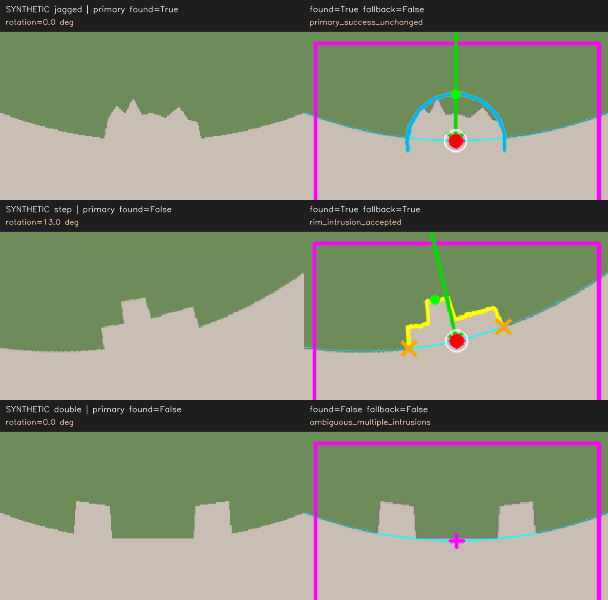

# 기존 notch 검출 실패 때만 실행하는 보완 검출

기존 반원/반타원 검출은 유지합니다. 그 검출이 미검출로 판정될 때만 같은 ROI의
외곽 함몰을 검사하는 `rim_intrusion` 보완을 실행합니다. 약간 깨진 notch처럼
곡선 fitting에 맞지 않는 경우를 위한 보완이며, 모든 손상을 notch로 인정하지 않습니다.

## 통째 복붙 사용법

[`wafer_via_notch_standalone.py`](wafer_via_notch_standalone.py) 전체를 자기 코드 위에
붙여 넣으면 다음처럼 바로 호출할 수 있습니다. 별도 프로젝트 파일 import는 필요
없고 외부 패키지 `numpy`, `opencv-python`은 필요합니다.
[`wafer_via_notch_adaptive_standalone.py`](wafer_via_notch_adaptive_standalone.py)도
고정 ROI를 지정하면 같은 보완을 지원합니다. ROI 없는 기존 adaptive 경로는 그대로입니다.

```python
dm = build_die_map_from_yolo(
    wafer_image=wafer_bgr,       # 메모리 BGR ndarray 또는 이미지 경로
    clip_image=center_clip_bgr, # YOLO를 수행한 clip
    detections=results[0].boxes.xywh.cpu().numpy(),
    detection_format="xywh",   # (N, 4): 중심 x, 중심 y, 너비, 높이; clip 픽셀 단위

    # 예시일 뿐입니다. 원본 wafer에서 실제 notch 위치/크기에 맞추세요.
    # notch 전체, 외부 배경, 양옆의 정상 외곽까지 ROI에 포함해야 합니다.
    notch_roi_center_px=(5000, 9650),
    notch_roi_half_size_px=(600, 600),
    notch_use_roi_background=True,

    notch_fallback_mode="rim_intrusion",  # 기본값. "none"이면 보완 끔
    notch_failure_mode="error",          # 모두 미검출이면 예외. "zero"는 보정각 0°
    return_notch_visuals=True,            # 진단용 이미지 생성; 기본값은 False
)
```

`refine`, 직접 입력하는 pitch, YOLO 입력 형식, 기존 반환값과 `locate_die()` 사용법은
바뀌지 않습니다. `dm.aligned_image`를 회전 보정하며 die-map은 그 정렬 좌표계에서
수평·수직입니다. `dm.grid_angle_deg == 0.0`도 유지합니다.

## 정확히 언제 실행하나

| 조건 | 동작 |
| --- | --- |
| 기존 형상 검출 성공 | 기존 결과 그대로 반환. 보완 검출 미실행 |
| 기존 검출 실패 + 고정 ROI + ROI 배경 사용 + `"rim_intrusion"` | 같은 ROI에서 보완 검출 |
| `"none"`, ROI 미지정, 또는 ROI 배경 사용 안 함 | 보완 미실행. 기존 미검출 정책 적용 |
| 보완 성공 | 보완 방향으로 이미지를 회전하고 DM 생성 |
| 기존·보완 모두 미검출 | `"error"`: `RuntimeError`, `"zero"`: `found=False`, 보정각 `0°` |

여기서 “에러일 때만”은 **검출기의 미검출 판정 이후**라는 뜻입니다. 잘못된 인자,
이미지 읽기 오류, 배경 분할·원 fitting 단계의 예외나 프로그래밍 오류를 일괄
`try/except`로 숨기지 않습니다. 기존 검출이 성공으로 통과한 오검출도 다시 검사하지 않습니다.

## 보완 방향을 계산하는 기준

1. 기존 검출에서 얻은 wafer 외곽원과 영상 테두리에 연결된 외부 배경을 재사용합니다.
   배경색을 검은색으로 고정하지 않고, 새 원을 임의로 fitting하지도 않습니다.
2. ROI 안에서 바깥 배경부터 wafer 쪽으로 접근하여 원보다 안으로 들어온 깊이를
   방향별로 검사합니다. 내부에 고립된 어두운 무늬까지 관통해 찾지는 않습니다.
3. 제한적인 노이즈 완화 후 함몰 양옆이 정상 외곽으로 돌아오는 두 입구 경계,
   즉 “어깨”를 찾습니다.
4. 양쪽 어깨 **방향의 각도 중간**을 외곽원 위로 투영한 점이 최종 notch 방향점입니다.
   비대칭으로 가장 깊게 깨진 점이나 함몰 면적의 무게중심을 angle 기준으로 쓰지 않습니다.

깊이·폭·연속된 함몰 면적, 양쪽 정상 외곽, 작은 임계값 변화에 대한 방향 안정성을
확인합니다. 원 fitting이 불안정하거나, 어깨가 ROI/영상 경계에 잘리거나, 비슷한
후보가 여러 개면 보완도 거절합니다. `notch_semicircle_radius_range_px`를 지정했다면
보완에서도 입구 가로 반폭 제한으로 사용합니다.

## 새 진단 반환값

```python
r = dm.notch_result
print(r.found)
print(r.detection_method)
print(r.fallback_attempted)             # 보완 검출을 시도했는가
print(r.fallback_used)                  # 보완 검출이 성공해 최종값으로 사용됐는가
print(r.fallback_reason)                # 미시도 "", 성공 또는 거절 이유
print(r.notch_shoulder_points_px)       # 보완 성공 시 ((x1, y1), (x2, y2)); 아니면 None
print(r.fallback_angle_stability_deg)   # 보완 성공 시 임계값 변경에 따른 방향 변화량
print(r.notch_point_px)                 # 최종 방향을 외곽원에 투영한 점
print(r.notch_deepest_point_px)         # 가장 깊은 점; 보완 angle의 기준점은 아님
print(r.correction_angle_deg)

# 편의용 DM 속성도 제공합니다.
print(dm.notch_fallback_attempted)
print(dm.notch_fallback_used)
print(dm.notch_fallback_reason)
print(dm.notch_shoulder_points_px)
```

보완을 시도하지 않으면 `fallback_attempted=False`, `fallback_used=False`, 이유는
빈 문자열입니다. `fallback_angle_stability_deg=0.0`은 보완 미실행/실패의 기본값일 수도
있으므로 반드시 `fallback_used`와 함께 읽어야 합니다. 성공 이유는
`"rim_intrusion_accepted"`, 검출 방식은 `"roi_background_rim_intrusion_fallback"`입니다.

보완은 반원/반타원을 fitting하지 않습니다. 보완 사용 시 `semicircle_shape="none"`,
반원 중심·반지름은 `None`이고 기존 곡선 fit 점수로 보완의 품질을 판단하면 안 됩니다.

대표 거절 이유는 다음과 같습니다.

| `fallback_reason` | 확인할 부분 |
| --- | --- |
| `unreliable_wafer_circle`, `rim_disagrees_with_wafer_circle` | 하늘색 원이 실제 외곽과 일치하는지 |
| `insufficient_roi_rim_support` | ROI에 외부 배경과 정상 외곽이 충분한지 |
| `missing_or_clipped_shoulders`, `shoulders_do_not_return_to_rim` | 함몰 양쪽 정상 외곽이 잘리지 않았는지 |
| `ambiguous_multiple_intrusions` | ROI 안에 비슷한 파임이 여러 개 있는지 |
| `unstable_mouth_shoulders`, `unstable_mouth_angle` | 노이즈나 손상 때문에 입구 위치가 흔들리는지 |
| `no_significant_rim_intrusion`, `insufficient_intrusion_area` | 실제 함몰의 깊이·면적이 충분한지 |
| `implausible_intrusion_width`, `intrusion_width_outside_radius_range` | 폭 제한과 ROI 크기가 실제 notch에 맞는지 |

`notch_failure_mode="error"`에서 모두 미검출이면 반환 객체 대신 예외가 발생하며
메시지에 보완 거절 이유가 포함됩니다. 미검출 오버레이가 필요하면 진단 중에만
`notch_failure_mode="zero"`를 사용하고 `found=False` 결과를 정상 검출로 취급하지 마십시오.

## 결과 이미지에서 확인할 점

```python
import cv2

cv2.imwrite("notch_overlay.png", dm.notch_overlay_image)
cv2.imwrite("notch_zoom.png", dm.notch_zoom_image)
cv2.imwrite("wafer_aligned.png", dm.aligned_image)
```

- 하늘색 큰 원: 기존 배경 분할로 얻은 wafer 외곽원
- 주황색 X 두 개: 보완 angle의 근거인 입구 양쪽 어깨
- 노란 경계: 보완 검출이 관측한 실제 inward 경계; 가상의 반원은 그리지 않음
- 빨간점: 두 어깨 방향의 중간을 외곽원에 투영한 점
- 초록선: wafer 중심에서 빨간점으로 향하는 방향

`found=False`이면 최종 notch 빨간점·방향선을 그리지 않습니다. `"zero"`로 반환된
방향점 좌표는 기준각용 기본값이지 검출된 notch가 아닙니다.

다음 합성 자료는 위부터 기존 성공 유지, 깨진 계단형의 실패 후 복구, 복수 함몰
거절입니다. 왼쪽은 입력, 오른쪽은 검출 표시이며 실제 장비 검출률을 뜻하지 않습니다.



재생성: 저장소 루트에서 `python tools/build_notch_fallback_preview.py`.

`r.notch_shoulder_points_px`, `r.notch_point_px`와 `dm.notch_shoulder_points_px`는
**원본 wafer 좌표**입니다. 축소된 `dm.notch_overlay_image`에 직접 그릴 때는 영상
축소 비율을 적용해야 합니다. `dm.aligned_image`에 직접 그릴 때는 DM의 정렬 affine
변환을 적용해야 하며, 원본 좌표를 그대로 그리면 위치가 어긋납니다.
이미 변환된 대표 방향점은 `dm.notch_point_aligned_px`입니다.

## 한계와 현장 확인

보완은 반원 모양을 요구하지 않지만, 단일 영상만으로 임의의 깨짐과 설계된 notch를
항상 구분할 수는 없습니다. 하늘색 외곽원부터 잘못되었다면 보완 결과도 신뢰할 수
없습니다. ROI, 배경 분할, 외곽원, 입구 두 점 순서로 확인하십시오.

합성 이미지 테스트는 실패 분기·좌표·회전 처리가 맞는지 확인하는 용도입니다.
제공되지 않은 실제 장비 데이터의 검출 정확도를 보장하지 않습니다. 생산에서는
여러 실제 이미지로 오검출과 미검출을 확인한 뒤 적용하십시오.

이번 변경 검증: `python -m pytest -q`에서 **62 passed, 184 subtests passed**.
기존 커밋 `8f6d8e9`의 정상 반원/불규칙 성공 사례 2개와 비교해, 기존 수치·배열
반환 필드가 모두 동일한 것도 확인했습니다. `confidence`는 기하 조건 점수이며
실측 정답 확률이 아닙니다.

더 자세한 ROI 설정과 배경 진단은 [고정 ROI 설명서](README_NOTCH_ROI_SEMICIRCLE_KO.md)를
참고하십시오.
