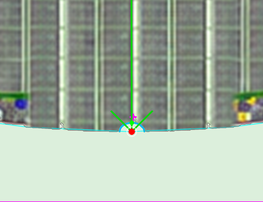
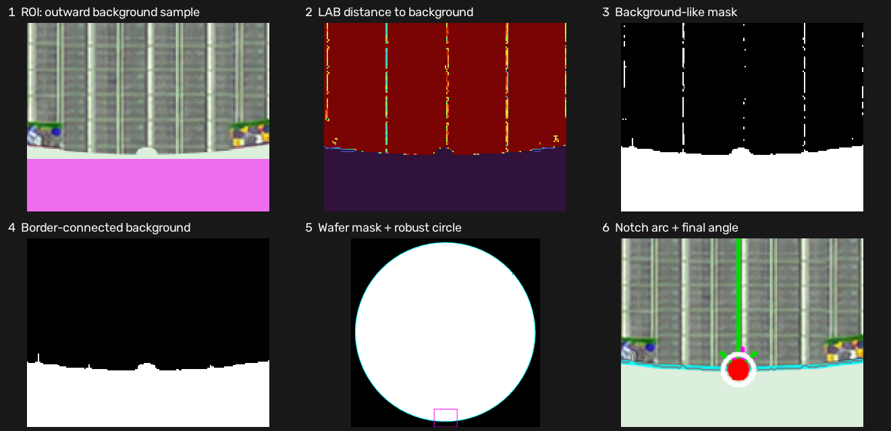
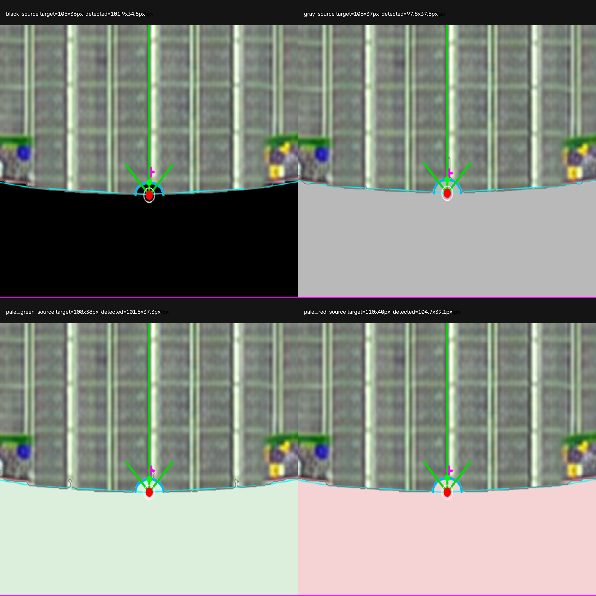

# 고정 ROI 얕은 타원형 notch angle 보정 사용법

## 목적

장비에서 wafer notch가 항상 비슷한 좌표에 나타날 때, 사용자가 지정한 원본
이미지 ROI의 **wafer 바깥쪽 색**을 먼저 학습합니다. 영상 테두리와 연결된 배경만
남겨 wafer 실루엣과 외곽원을 다시 만들고, 같은 배경 경계에서 U자 반원 또는
옆으로 길고 얕은 반타원(semi-ellipse)을 찾아
full wafer 이미지와 die-map을 회전 보정합니다. ROI 밖의 외곽선, die street,
장식성 원형 edge는 notch angle 후보가 될 수 없습니다.

복사할 파일은 아래 하나입니다.

```text
wafer_via_notch_standalone.py
```

외부 패키지는 `numpy`, `opencv-python`만 필요합니다.

## 가장 간단한 호출

```python
from wafer_via_notch_standalone import build_die_map_from_yolo

dm = build_die_map_from_yolo(
    wafer_image=wafer_bgr,             # full wafer BGR ndarray 또는 경로
    clip_image=center_clip_bgr,         # YOLO를 수행한 중앙 clip
    detections=yolo_points,
    detection_format="point",
    clip_origin=(clip_x, clip_y),

    # 원본 full wafer 이미지 좌표입니다.
    notch_roi_center_px=(5000, 9650),
    notch_roi_half_size_px=(600, 600),

    # 기본값 True: ROI 바깥쪽 band의 배경색을 학습합니다.
    notch_use_roi_background=True,

    # 검출된 notch를 정렬 후 6시 방향에 둡니다.
    notch_reference_angle_deg=90.0,

    # angle 결과 오버레이를 5000×5000으로 반환합니다.
    notch_visual_max_dimension=5000,

    # 잘못된 angle로 계속 진행하지 않도록 운영에서는 error를 권장합니다.
    notch_failure_mode="error",
)
```

`image5`의 10000×10000 샘플은 `(5000, 9650)` 부근이지만 실제 장비 이미지에서는
오버레이를 확인해 좌표를 조정해야 합니다. ROI 좌표와 크기는 축소 분석 이미지가
아니라 항상 원본 `wafer_image` 픽셀 단위입니다.

## notch 크기를 알고 있을 때

장비에서 notch 크기도 일정하면 가로 반폭 범위를 추가해 오검출을 더 줄일 수 있습니다.
인자 이름은 기존 호환 때문에 `radius_range`지만, 얕은 반타원에서는 가로 전체 폭의
절반으로 해석합니다.

```python
dm = build_die_map_from_yolo(
    ...,
    notch_roi_center_px=(5000, 9650),
    notch_roi_half_size_px=(600, 600),
    notch_semicircle_radius_range_px=(40, 70),
    notch_semicircle_min_score=0.55,
    notch_failure_mode="error",
)
```

가로 반폭 범위도 원본 이미지 픽셀 단위입니다. 실제 크기를 모르면 이 옵션은 생략하고
자동 범위를 사용하십시오.

## 개선된 angle 보정 원리

1. 고정 notch ROI에서 wafer 중심과 반대 방향의 바깥쪽 band를 선택합니다.
2. 그 band의 BGR 색을 LAB 공간의 1~3개 palette로 학습합니다.
3. 전체 영상에서 palette와 가까운 픽셀을 찾되, **영상 테두리와 연결된 배경만**
   유지합니다. 바깥 패턴의 고립된 노이즈는 이 단계에서 제거됩니다.
4. 연결 배경을 반전해 wafer 실루엣을 만들고 contour 점을 robust circle-fit하여
   wafer 중심과 외곽 반지름을 다시 계산합니다.
5. ROI 안의 연결 배경 경계에서 wafer 외곽원보다 안으로 들어온 부분만 분리합니다.
6. `depth² = A·x² + B·x + C` robust fitting으로 반타원의 가로 반폭과 깊이를 각각
   계산합니다. 가로와 세로가 같을 필요가 없어 얕고 넓은 notch도 검출합니다.
7. `wafer 중심 → 반타원 기준점` 방향을 `notch_angle_deg`로 사용합니다.
8. notch가 `notch_reference_angle_deg`에 오도록 full wafer 이미지를 회전합니다.
9. 같은 affine matrix로 YOLO 기준점과 die-map 좌표를 변환합니다.

기존 LAB edge/Hough 방식으로 비교해야 할 때만
`notch_use_roi_background=False`로 설정할 수 있습니다.

이미지 좌표 angle은 오른쪽 `0°`, 아래쪽 `90°`, 왼쪽 `180°`, 위쪽 `270°`입니다.

```text
correction_angle_deg = notch_angle_deg - notch_reference_angle_deg
```

반환된 `dm.aligned_image`에는 이 보정각이 적용됩니다. 반환 die-map은 이미 정렬된
좌표계이므로 `dm.grid_angle_deg == 0.0`입니다.

## 반드시 확인할 결과

```python
print(dm.notch_result.found)
print(dm.notch_angle_deg)
print(dm.notch_correction_angle_deg)
print(dm.image_rotation_deg)

print(dm.notch_roi_center_px)
print(dm.notch_roi_bounds_px)
print(dm.notch_semicircle_center_px)
print(dm.notch_semicircle_radius_px)
print(dm.notch_semicircle_radius_x_px)  # 가로 반폭
print(dm.notch_semicircle_radius_y_px)  # 깊이
print(dm.notch_semicircle_shape)        # "semiellipse" 또는 "semicircle"
print(dm.notch_semicircle_score)
print(dm.notch_semicircle_fit_residual_px)
print(dm.notch_background_segmentation_used)
print(dm.notch_background_palette_bgr)
print(dm.notch_background_distance_threshold_lab)

print(dm.coordinate_space)   # "aligned_image"
print(dm.grid_angle_deg)     # 0.0
```

`semicircle_score`가 높더라도 오버레이 확인을 생략하면 안 됩니다. 실제 arc fitting이
좋을수록 `semicircle_fit_residual_px`가 작습니다. 카메라 해상도와 blur가 달라지므로
고정 합격값은 실제 양품 데이터로 정해야 합니다.

## 오버레이 저장과 판독

```python
import cv2

cv2.imwrite("notch_roi_overview_5000.png", dm.notch_overlay_image)
cv2.imwrite("notch_roi_zoom.png", dm.notch_zoom_image)
cv2.imwrite("wafer_aligned.png", dm.aligned_image)
```

10000×10000 정사각형 입력에서 `dm.notch_overlay_image.shape`은
`(5000, 5000, 3)`입니다. `dm.aligned_image`는 die-map 좌표 기준이므로 원본 크기를
유지합니다. 5000보다 작은 입력은 화질 저하를 막기 위해 확대하지 않습니다.

- 자홍색 사각형: 실제 연산을 허용한 ROI
- 자홍색 십자: 사용자가 입력한 예상 notch 위치
- 하늘색 arc와 점: robust fitting된 반원/반타원과 기준점
- 노란 arc: angle 계산에 사용한 inward edge 구간
- 빨간점: wafer 외곽 원 위의 최종 notch 방향점
- 초록선: wafer 중심에서 notch 방향으로 향하는 angle 벡터
- 하늘색 큰 원: 연결 배경으로 만든 wafer 실루엣에 robust fitting한 외곽 원

하늘색 notch 표시는 전체 원을 크게 그리지 않고, 실제 계산에 사용한 inward arc만
표시합니다.



## 단계별 배경 분할 확인

```python
from wafer_via_notch_standalone import make_notch_background_debug_contact_sheet

debug_sheet = make_notch_background_debug_contact_sheet(
    wafer_bgr,
    notch_roi_center_px=(5000, 9650),
    notch_roi_half_size_px=(600, 600),
    notch_semicircle_radius_range_px=(40, 70),  # 가로 반폭, 모르면 생략
)
cv2.imwrite("notch_background_stages.png", debug_sheet)
```



6개 패널은 왼쪽 위부터 다음 순서입니다.

1. ROI에서 실제 배경색을 뽑은 바깥쪽 band
2. 학습 palette와의 LAB 거리
3. 색만으로 분류한 background-like mask
4. 영상 테두리와 연결된 외부 배경만 남긴 mask
5. 반전한 wafer mask와 robust 외곽원
6. 최종 U자 반원/반타원과 angle

3번에는 바깥 패턴 노이즈가 보일 수 있지만 4번에서 고립 성분이 사라지는지 확인하면
됩니다. 4번부터 잘못되면 arc 파라미터보다 먼저 배경 palette/threshold를 조정해야
합니다.

## 현장에서 조정할 값

```python
dm = build_die_map_from_yolo(
    ...,
    notch_roi_center_px=(5000, 9650),
    notch_roi_half_size_px=(600, 600),
    notch_background_outer_band_fraction=0.28,
    notch_background_palette_size=3,
    notch_background_distance_threshold_lab=None,  # None이면 ROI에서 자동 계산
    notch_background_noise_margin_lab=4.0,
    notch_background_morph_px=24.0,
)
```

- ROI 위치/크기: notch 전체와 wafer 바깥쪽 배경이 함께 들어오게 합니다.
- `outer_band_fraction`: 배경 sample이 부족하면 키우고 wafer가 섞이면 줄입니다.
- `distance_threshold_lab`: 자동값으로 불안정할 때만 고정합니다. 낮추면 엄격,
  높이면 허용 범위가 넓어집니다.
- `noise_margin_lab`: 자동 threshold에 더하는 여유값입니다.
- `morph_px`: 배경 mask의 작은 끊김을 잇는 크기입니다. 실제 해상도 픽셀 단위입니다.

## notch만 먼저 검증

YOLO와 die-map을 실행하기 전에 notch 검출만 독립적으로 확인할 수 있습니다.

```python
from wafer_via_notch_standalone import detect_wafer_notch, make_notch_overlay

result = detect_wafer_notch(
    wafer_bgr,
    notch_roi_center_px=(5000, 9650),
    notch_roi_half_size_px=(600, 600),
    failure_mode="error",
)

print(result.notch_angle_deg)
print(result.correction_angle_deg)
print(result.semicircle_fit_residual_px)
print(result.semicircle_radius_x_px)
print(result.semicircle_radius_y_px)
print(result.semicircle_shape)
print(result.background_palette_bgr)
print(result.background_distance_threshold_lab)

overlay = make_notch_overlay(wafer_bgr, result, max_dimension=5000)
cv2.imwrite("notch_roi_check.png", overlay)
```

## 미검출 정책

운영에서는 다음 설정을 권장합니다.

```python
notch_failure_mode="error"
```

notch arc를 못 찾으면 `RuntimeError`를 발생시켜 잘못된 wafer angle로 다음 검사를 진행하지
않습니다. `"zero"`는 테스트나 notch 없는 이미지용이며 미검출 시 회전각을 `0°`로
두고 계속 진행합니다.

## 실제 장비 적용 전 점검

`image5`에는 **10000×10000 원본 이미지 기준**으로 notch 크기가 서로 다른 다음 4개
검증 영상을 추가했습니다.

- black: 105×36 px
- gray: 106×37 px
- pale green: 108×38 px
- pale red: 110×40 px

위 숫자는 원본에 실제로 그린 크기입니다. 5000×5000 angle 결과는 0.5배 축소되므로
화면상 크기는 각각 `52.5×18`, `53×18.5`, `54×19`, `55×20 px`입니다.
기존 샘플의 중앙 하단 반원 장식은 직선 grid texture로 제거했습니다. 따라서 아래
검증 영상에서 반원/반타원 형상은 wafer 최외곽 notch 하나뿐입니다. 로직도 영상
테두리와 연결된 배경 경계만 사용하므로 wafer 내부의 고립된 반원 패턴은 후보에서
제외됩니다.



`image5` 결과는 제공된 테스트 이미지에 대한 기하 검증입니다. 실제 카메라의 반사,
blur, 잘림, 배경 변화까지 보장하는 생산 검증은 아닙니다.

1. 자홍색 ROI가 실제 notch 전체를 포함하는지 확인합니다.
2. 단계별 이미지 1번의 자홍색 band에 wafer 색이 과하게 섞이지 않았는지 확인합니다.
3. 4번의 흰색 외부 배경이 영상 테두리에서 notch까지 끊기지 않는지 확인합니다.
4. 5번의 하늘색 외곽원이 실제 wafer 테두리를 따르는지 확인합니다.
5. 6번의 하늘색 반원/반타원 arc와 빨간점이 실제 notch 방향에 놓이는지 확인합니다.
6. 여러 정상 wafer에서 angle, 외곽원 잔차, arc 잔차의 분포를 기록합니다.
7. 생산 합격 기준은 그 정상 데이터 분포로 정합니다.
