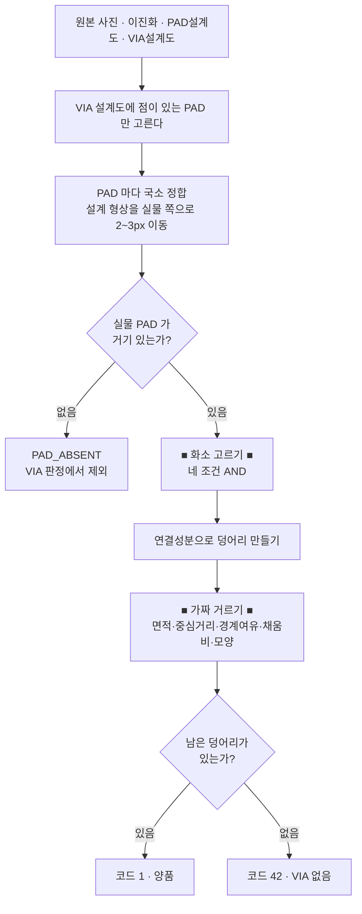

# VIA 를 어떤 원리로 찾는가

`via_checker.py` 가 원본 사진 한 장에서 VIA 를 찾아내는 과정을 처음부터 끝까지
적었습니다. **직접 고치실 곳이 어디인지** 를 가장 먼저 적어 두었습니다.

---

## 0. 고치실 곳은 딱 두 군데입니다

### (1) 조건을 더하거나 빼려면 — `via_checker.py` 의 `_find_via()` 안

```python
    # >>>>>>>>>>>>>>>>>>>>>>>  VIA 검출 로직 시작  >>>>>>>>>>>>>>>>>>>>>>>>>>>>>
    ...   여기 네 줄이 전부입니다
    cand = (c_color & c_dark & c_warm & c_hat & m).astype(np.uint8)
    # <<<<<<<<<<<<<<<<<<<<<<<  VIA 검출 로직 끝  <<<<<<<<<<<<<<<<<<<<<<<<<<<<<<<<
```

이 구간 밖에서는 화소를 하나도 만들지 않습니다.
조건을 하나 빼고 싶으면 `cand = (...)` 에서 그 항만 지우면 됩니다.

### (2) 숫자만 만지려면 — 파일 위쪽 상수 블록

```python
# ----------------------------------------------------------------------------
# ★ VIA 검출 조건 ★  <- 검출 결과를 바꾸고 싶으면 이 네 값입니다
# ----------------------------------------------------------------------------
COLOR_K = 3.5           # [1] 색상차 임계 (크게 = 확실히 다른 것만)
COLOR_FLOOR = 6.0       # [1] 임계 하한   (깨끗한 PAD 에서 임계가 0 이 되는 것 방지)
VIA_DARK_MARGIN = 3.0   # [2] PAD 보다 최소 이만큼은 어두워야 한다
VIA_WARM_TOL = 12.0     # [3] 검정·갈색 허용폭 (크게 = 색을 덜 따진다)
```

호출할 때 한 번만 밀고 싶으면 코드를 안 고쳐도 됩니다.

```python
code, result, via_bin = check_via(원본, 이진화, PAD설계도, VIA설계도,
                                  dark_offset=-15)   # 음수 = 덜 잡는다
```

---

## 1. 전체 흐름



한 PAD 라도 42 가 나오면 이미지 전체 코드가 42 입니다.

---

## 2. 화소 고르기 — 네 조건의 AND

VIA 는 **PAD 표면에 뚫린 구멍** 입니다. 그래서 네 가지가 동시에 성립합니다.

| | 조건 | 무엇을 막는가 |
|---|---|---|
| **[1]** | PAD 대표색과 색이 다르다 | PAD 표면 자체 |
| **[2]** | PAD 보다 어둡다 | 반사·하이라이트·밝은 이물 |
| **[3]** | 검정 또는 갈색 계열이다 | 파랑·초록으로 튄 이물 |
| **[4]** | 주변에서 홀로 우묵하다 | 완만한 조명 기울기·그림자 |

```
     [1] 색이 다른 곳          [2] 어두운 곳
     ┌──────────────┐          ┌──────────────┐
     │ ▒▒        ▒▒ │          │ ▒▒▒▒▒▒    ▒▒ │
     │   ██▓        │          │   ██▓  ▒▒▒   │
     │     ▒▒   ▒▒▒ │          │ ▒▒  ▒▒       │
     └──────────────┘          └──────────────┘
              ↓  AND  ↓  AND  [3] AND [4]
                 ┌──────────────┐
                 │              │
                 │   ██         │   ← 남는 것은 VIA 뿐
                 │              │
                 └──────────────┘
```

### [1] PAD 대표색과 색이 다른가 (`c_color`)

```python
base = np.median(f[m], axis=0)          # PAD 대표색 (B, G, R) - 채널별 중앙값
diff = np.abs(f - base).sum(axis=2)     # 대표색과의 L1 색상차
d = diff[m]
d_med  = np.median(d)
scale  = max(1.4826 * np.median(np.abs(d - d_med)), COLOR_FLOOR)   # MAD
thr    = d_med + COLOR_K * scale - dark_offset
c_color = diff > thr
```

- **대표색을 평균이 아니라 중앙값으로** 잡습니다. 평균을 쓰면 VIA 와 얼룩이
  대표색을 자기 쪽으로 끌고 가서, 정작 VIA 가 "PAD 색과 비슷" 해집니다.
- **임계도 표준편차가 아니라 MAD** 로 잡습니다. 이유는 같습니다.
  `1.4826` 은 MAD 를 표준편차 스케일로 환산하는 상수입니다.
- **PAD 마다 따로 계산합니다.** 조명이 한쪽만 밝아도, PAD 마다 자기 밝기를
  기준으로 재기 때문에 그대로 통과합니다.
- 단위가 밝기(0~255)가 아니라 **세 채널의 합** 이라 대략 3배 스케일입니다.
  `dark_offset` 을 한 번에 크게 움직이지 말고 -15 정도씩 옮기세요.

`debug_via` 의 `임계` 열에 실제 적용된 `thr` 이 그대로 찍힙니다.

### [2] PAD 보다 어두운가 (`c_dark`)

```python
med = np.median(gray[m])                       # PAD 대표 밝기
c_dark = gray < med - VIA_DARK_MARGIN
```

[1] 은 절댓값이라 **밝은 쪽으로 튄 화소도 통과** 시킵니다. VIA 는 구멍이라
언제나 어두운 쪽입니다. 그래서 방향을 못 박습니다.

절대 밝기가 아니라 **PAD 중앙값 대비** 로 재는 것이 중요합니다.
그래야 조명이 바뀌어도 임계가 따라옵니다.

### [3] 검정 또는 갈색 계열인가 (`c_warm`)

```python
c_warm = ((f[:, :, 0] <= f[:, :, 2] + VIA_WARM_TOL) &   # B <= R + tol
          (f[:, :, 1] <= f[:, :, 2] + VIA_WARM_TOL))    # G <= R + tol
```

VIA 는 검정 아니면 진한 갈색입니다.

```
    검정  B ≈ G ≈ R          예: (18, 20, 22)   →  통과
    갈색  R  >  G  >  B      예: (30, 55, 95)   →  통과
    청색  B  >  R            예: (120, 60, 40)  →  탈락
```

**왜 HSV 색상(Hue)을 안 쓰는가.**
어두운 화소는 HSV 에서 색상·채도가 불안정합니다. 예를 들어 BGR(10, 8, 6) 은
거의 검정인데 채도가 100 을 넘고 색상은 파랑 근처로 계산됩니다.
색상으로 거르면 **진짜 검은 VIA 가 탈락합니다.** BGR 채널 대소 비교는
이 문제가 없습니다.

`VIA_WARM_TOL = 12` 는 여유폭입니다. 순수한 검정에서 센서 노이즈로 B 가 R 보다
몇 단계 높게 찍히는 일이 흔하기 때문에 그만큼 봐줍니다.

### [4] 주변에서 홀로 우묵한가 (`c_hat`)

```python
filled = np.where(shape > 0, gray, np.uint8(round(med)))   # PAD 바깥을 메운다
ks = clip(round(radius * BLACKHAT_KSIZE_RATIO) | 1, 5, 31)
se = cv2.getStructuringElement(cv2.MORPH_ELLIPSE, (ks, ks))
bh = cv2.morphologyEx(filled, cv2.MORPH_BLACKHAT, se)
c_hat = bh > max(BLACKHAT_MIN, med * BLACKHAT_RATIO)
```

Black-hat = `닫힘(closing) - 원본` 입니다. 구조요소보다 작은 **우묵한 곳만**
남고, 넓게 완만히 어두워지는 곳은 closing 도 같이 내려가서 0 이 됩니다.

```
    밝기 단면                       Black-hat 결과
    ────╲___╱────────  VIA          ────█────────   남는다
    ─────────╲______   조명 기울기   ─────────────   0 (사라진다)
```

구조요소 크기를 **PAD 반지름에 비례** 시키므로 배율이 달라져도 그대로 씁니다.

`PAD 바깥을 PAD 중앙값으로 메우는 것` 이 핵심입니다. 안 메우면 PAD 가장자리
근처 VIA 에서 closing 이 바깥의 어두운 배경에 끌려 내려가 응답이 사라집니다.

### 그리고 [5] PAD 안쪽인가 (`m`)

```python
inner = cv2.erode(shape, ero)   # PAD_ERODE = 1
m = inner > 0
```

PAD 경계선 자체가 딸려 들어오는 것만 막습니다. **1px 만** 깎습니다.
연한 VIA 는 화소가 4~5개뿐이라 더 깎으면 통째로 사라집니다.

---

## 3. 가짜 거르기 — 덩어리 단위

```python
num, lab, stats, cents = cv2.connectedComponentsWithStats(cand, 8)
```

> **여기서 `MORPH_OPEN` 으로 잡티를 지우면 안 됩니다.**
> 대비가 약한 VIA 는 임계 아래로 내려가는 화소가 4~5개뿐이고 모양도
> 십자/대각이라 2x2 로 열면 통째로 사라집니다(= 오검출 42).
> 잡티는 아래 면적 하한이 이미 담당합니다.

| 조건 | 상수 | 성격 | 무엇을 막는가 |
|---|---|---|---|
| 면적 | `VIA_MIN_AREA=4` ~ PAD면적×`0.25` | **탈락** | 잡티 / PAD 전면 얼룩 |
| 중심 거리 | `VIA_SEARCH_RATIO=0.75` | **탈락** | PAD 외곽의 검은 선·이웃 패턴 |
| 경계 여유 | `VIA_MIN_CLEARANCE=0.30` | **탈락** | PAD 테두리를 두른 어두운 링 |
| 채움비 | `VIA_MIN_FILL=0.45` | **탈락** | 두꺼운 링 / 잘린 호(弧) |
| 모양 | `VIA_MAX_ASPECT=2.2`, `VIA_MAX_RADIAL_DEV=0.45` | *선호* | 긁힘 자국 |

### '탈락' 과 '선호' 의 차이 — 중요합니다

**탈락** 은 되살아나지 않습니다. 다 탈락하면 코드 42 가 됩니다.

**선호** 는 후보 *선택* 만 바꾸고 판정을 뒤집지 못합니다.
원형 후보가 하나도 없으면 모양을 포기하고 가장 큰 것을 그냥 씁니다.

```python
if best < 0:
    best, best_area, best_shape = alt, alt_area, alt_shape   # 대안으로 되살림
```

왜 이렇게 하는가: 긁힘이 진짜 VIA 를 가로지르면 둘이 한 덩어리로 붙어
길쭉해집니다. 이때 탈락시키면 **멀쩡한 PAD 가 42 로 둔갑합니다.**
실측에서 이 역전이 4건 나왔고, 대안이 있을 때만 거르도록 바꿔 0건이 됐습니다.

### 중심 거리 — 외곽 검은 선 대책

```python
max_off = radius * VIA_SEARCH_RATIO
if np.hypot(cents[i][0] - pad_cx, cents[i][1] - pad_cy) > max_off:
    far_rejected += 1
    continue
```

```
        PAD                            PAD
   ┌───────────────┐              ┌───────────────┐
   │▓▓▓▓▓▓▓▓▓▓▓▓▓▓▓│ ← 외곽 검은   │               │
   │               │    선         │       ●       │ ← 진짜 VIA
   │       ●       │               │               │
   │               │              │▓▓▓▓▓▓▓▓▓▓▓▓▓▓▓│
   └───────────────┘              └───────────────┘
     중심거리 0.85 → 탈락            중심거리 0.03 → 통과
```

**화소 단위로 미리 마스킹하지 않고 덩어리 무게중심으로 재는 이유** 가 있습니다.
미리 잘라내면 범위 경계에 걸친 진짜 VIA 가 truncate 되어, 아래에서 재는
채움비·장단비·반경편차가 전부 망가집니다. 덩어리를 온전히 만든 뒤에
그 중심만 보고 판단합니다.

실측 분포:

| | n | 최소 | p1 | p95 | p99 | 최대 |
|---|---|---|---|---|---|---|
| 진짜 VIA (테스트셋) | 746 | - | - | 0.457 | 0.596 | **0.661** |
| 외곽 잡음 (VIA 없는 실물) | 191 | - | **0.771** | - | - | - |

0.66 ~ 0.77 사이가 비어 있어서 그 안에 선을 그었습니다.

| `VIA_SEARCH_RATIO` | 실물 오검출 | 테스트셋 PAD |
|---|---|---|
| 0.55 | 2 / 777 | 754 / 783 ← 쏠린 VIA 18개를 잘라먹음 |
| **0.75** | **2 / 777** | **772 / 783** ← 채택 |
| 0.90 | 179 / 777 | 772 / 783 ← 외곽 잡음이 다시 들어옴 |
| 제한 없음 | 191 / 777 | 772 / 783 |

몇 개가 잘렸는지는 `debug_via` 의 `중심탈락` 열에 찍힙니다.

### 경계 여유 — 테두리 링 대책

```python
dist = cv2.distanceTransform(shape > 0, cv2.DIST_L2, 5)
if dist[ys, xs].max() < radius * VIA_MIN_CLEARANCE:
    탈락
```

덩어리 안에서 **PAD 경계로부터 가장 먼 한 점** 을 봅니다.

이 조건이 꼭 필요한 이유: PAD 테두리를 한 바퀴 두른 어두운 링은
장단비 1.0 / 반경편차 0.1~0.2 라 **모양만 보면 완벽한 원** 이고,
무게중심도 PAD 중심과 겹쳐 중심 거리도 0 입니다.
즉 VIA 가 아예 없는 PAD 가 양품으로 둔갑합니다(불량 놓침).
모양으로도 위치로도 못 잡고 이 조건으로만 잡힙니다.

실측: 진짜 VIA 최소 0.536 · 중앙 0.965 / 테두리 링 중앙 0.254 · p1 0.086.

### 채움비 — 두꺼운 링 대책

```python
fill = area / (π * minEnclosingCircle_radius²)
```

경계 여유와 목적은 같은데 보는 곳이 다릅니다. 경계 여유는 **한 점** 만 보기
때문에, 링이 두껍게 잡히면 그 한 점이 임계를 아슬아슬하게 넘어 통과합니다
(실측: 8.00 vs 임계 7.71 로 통과). 채움비는 **덩어리 전체** 를 봅니다.

```
    꽉 찬 원              두꺼운 링              잘린 호(弧)
      ███                  █████                    ███
     █████                ██   ██                  █
     █████                ██   ██                  █
      ███                  █████                    ███
    fill 0.6~0.9          fill ~0.35             fill ~0.15
```

링이 이미지 끝에서 잘려 열린 C 자가 되어도 **최소외접원은 그대로 크기 때문에**
값이 낮게 유지됩니다. 이것이 이 지표를 고른 이유입니다.

### 모양

```
    장단비   = 외접 사각형의 긴변 / 짧은변           (원 = 1.0)
    반경편차 = 중심까지 거리의 표준편차 / 등가반지름  (꽉 찬 원 = 0.236, 크기 무관)
```

둘 다 무차원이라 배율이 바뀌어도 그대로 씁니다.
긁힘 자국은 1px 폭이라 장단비에서 걸립니다.

---

## 4. 국소 정합 — 왜 아직도 필요한가

쏠림을 판정하지 않게 됐는데도 정합은 그대로 필요합니다.
**중심 거리 조건과 PAD 유무 판정이 둘 다 PAD 중심을 기준점으로 쓰기** 때문입니다.

설계도와 실물이 2~3px 만 어긋나도 PAD 반지름이 6px 수준이면 기준점이 통째로
밀려서, 멀쩡한 VIA 가 탐색 범위 밖으로 잘려 나갑니다(= 42).

```
   정합 전                          정합 후
   ┌ ─ ─ ─ ─ ─┐                     ┌─────────┐
   │  ┌───────┼──┐                  │ ┌───────┤
   │  │   ●   │  │  ← 설계(점선)     │ │   ●   │   두 중심이 겹친다
   └ ─│─ ─ ─ ─┘  │     실물(실선)    └─│───────┤
      └──────────┘                     └───────┘
   중심이 3px 어긋남                  중심 일치
```

무게중심을 쓰는 이유:
- VIA 가 한가운데면 구멍이 대칭이라 무게중심이 밀리지 않습니다.
- VIA 가 쏠려 있으면 무게중심이 반대편으로 밀리므로, 정합이 VIA 를 따라가서
  쏠린 위치를 '중앙' 으로 만들어 버리는 일이 생기지 않습니다.

이동량은 반지름의 `ALIGN_MAX_RATIO = 0.40` 이내로 묶어 폭주를 막습니다.

---

## 5. 쏠림(코드 99)은 왜 없앴는가

과검이 너무 많았습니다.

편심은 `||VIA중심 - PAD중심|| / PAD등가반지름` 인데, PAD 반지름이 6px 수준이라
분모가 작습니다. 서브픽셀 무게중심을 쓰고 국소 정합까지 넣어도 1px 흔들림이
편심 0.17 로 증폭됩니다. 실물 공정 산포와 구분이 안 됐습니다.

**지금은 VIA 가 PAD 안에서 발견되기만 하면 위치와 무관하게 양품입니다.**

```
    코드   뜻                          예전
    ─────────────────────────────────────────────
      1    양품                         1
     42    VIA 없음                    42
     -1    입력 오류                   -1
                                       99  ← 삭제
```

편심 수치 자체는 `debug_via` 의 `편심px` / `편심비율` 열로 계속 볼 수 있습니다.
기준을 세우고 싶으면 호출한 쪽에서 직접 잡으세요.

```python
code, result, via_bin, rows = debug_via(원본, 이진화, PAD설계도, VIA설계도)
쏠림 = [r for r in rows if r["offset_norm"] and r["offset_norm"] > 0.5]
```

---

## 6. 실측 결과

| | 테스트셋 PAD 정확도 | VIA 없는 실물에서 VIA 를 찾아낸 수 |
|---|---|---|
| 이번 변경 전 | 772 / 783 | 191 / 777 |
| **이번 변경 후** | **772 / 783** | **2 / 777** |

- 테스트셋: 이미지 44장 / PAD 783개 (합성 정답 보유)
- 실물: 이미지 44장 / PAD 777개 (VIA 가 없는 참조 이미지 — 검출되면 전부 오검출)
- 두 모듈 코드 일치: 44 / 44

`c_dark`([2]) 와 `c_warm`([3]) 을 꺼도 위 두 수치는 그대로였습니다.
현재 데이터셋에는 밝은 이물이나 청색 이물이 없어서 걸릴 것이 없기 때문입니다.
공정 지식("VIA 는 항상 검정 아니면 진한 갈색")을 코드에 못 박아 두는 쪽이
안전하다고 보고 남겨 두었습니다.

---

## 7. 증상별 대처표

| 증상 | 먼저 볼 곳 | 방향 |
|---|---|---|
| VIA 를 못 찾는다 (42 과검) | `dark_offset` | **+** 방향으로 15씩 |
| PAD 얼룩을 VIA 로 본다 | `dark_offset` | **-** 방향으로 15씩 |
| PAD 외곽 선을 VIA 로 본다 | `VIA_SEARCH_RATIO` | 내린다 (`중심탈락` 열 확인) |
| 쏠린 VIA 가 42 로 나온다 | `VIA_SEARCH_RATIO` | 올린다 |
| 테두리 링을 VIA 로 본다 | `VIA_MIN_CLEARANCE` / `VIA_MIN_FILL` | 올린다 |
| 42 가 통째로 많다 | 국소 정합 | `정합이동` 열이 0 이면 `bin_mask` 를 확인 |
| 파랑·초록 이물을 잡는다 | `VIA_WARM_TOL` | 내린다 |
| 밝은 이물을 잡는다 | `VIA_DARK_MARGIN` | 올린다 |

수치를 바꾸기 전에 `debug_via` 를 먼저 돌려 보세요. 어느 조건에서 몇 개가
걸렸는지 `모양탈락` / `테두리탈락` / `중심탈락` 열에 그대로 찍힙니다.

```python
from via_checker import debug_via
code, result, via_bin, rows = debug_via(원본, 이진화, PAD설계도, VIA설계도)
```
